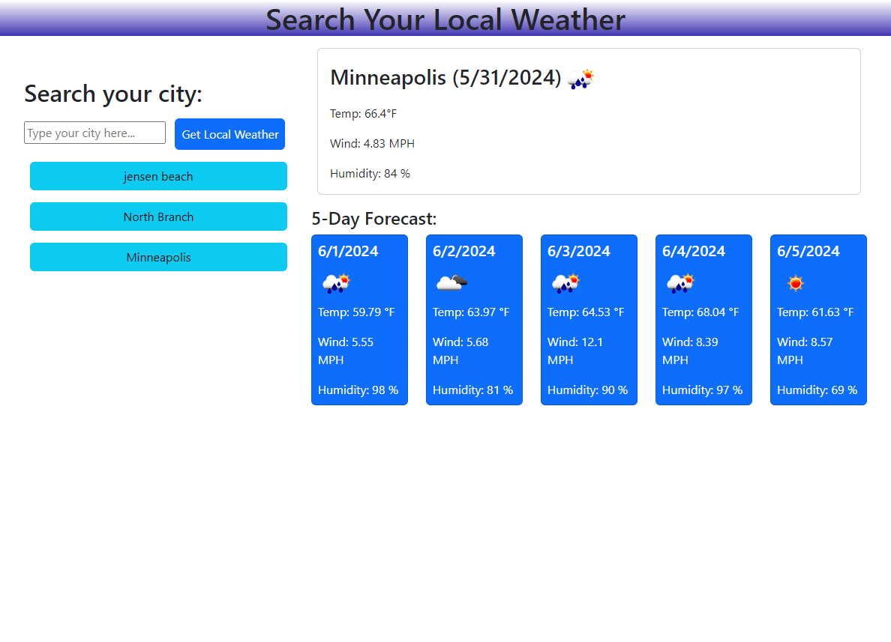

# Weather Dashboard

## Application Usage
This application uses the open weather map API and makes calls to that API to get your local weather. 

It also uses local storage to save previous locations that you have searched. 

Once you search your location the page dynamically displays your local weather information.

## Give it a try

## Contact Me

[Checkout My GitHub](https://github.com/EnchantedMoth)

Reach me via Email timothy.james.lewis.31@gmail.com

